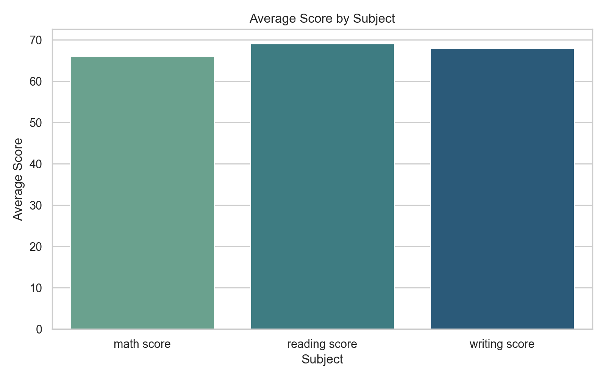
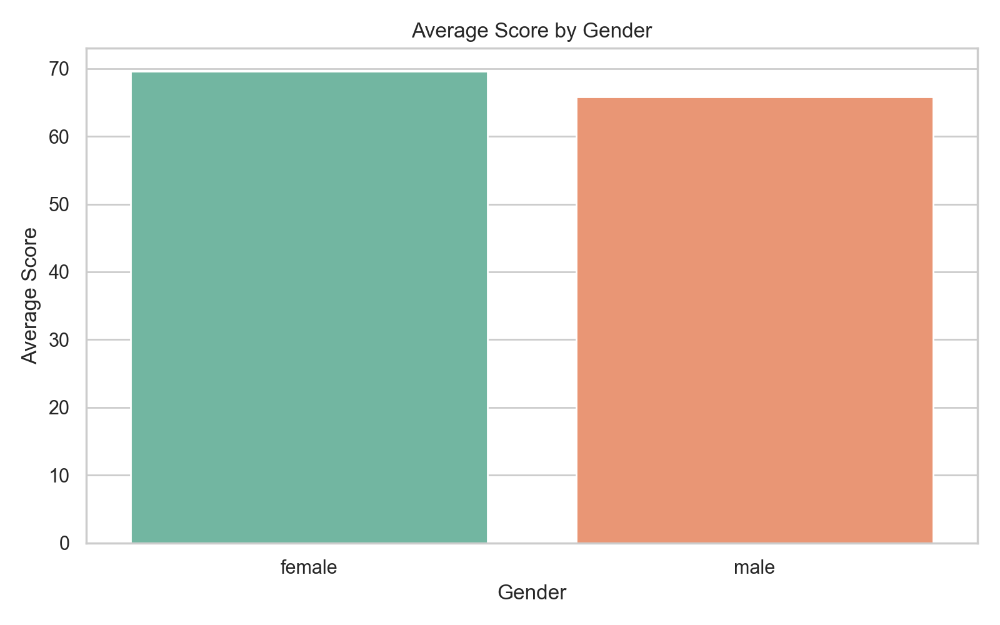
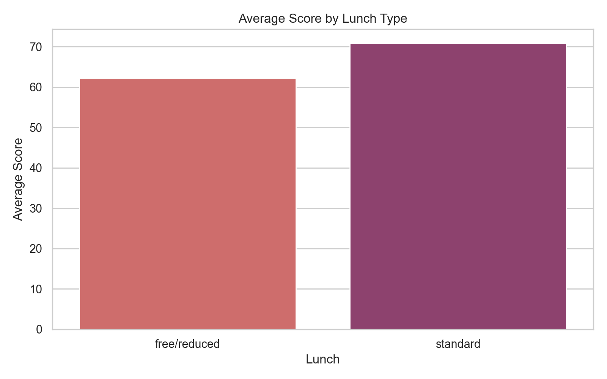
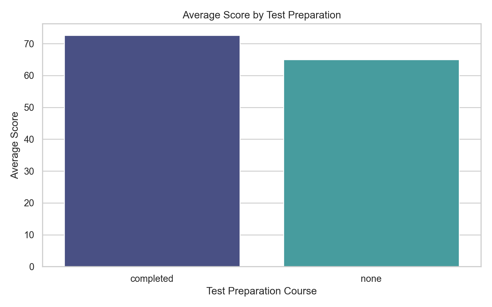
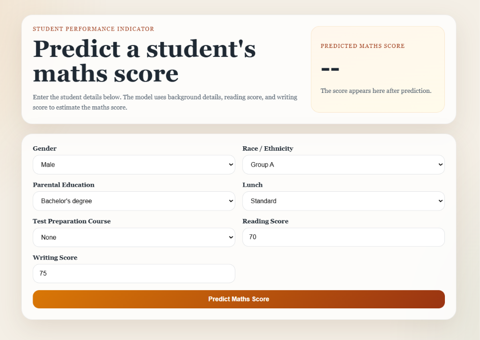
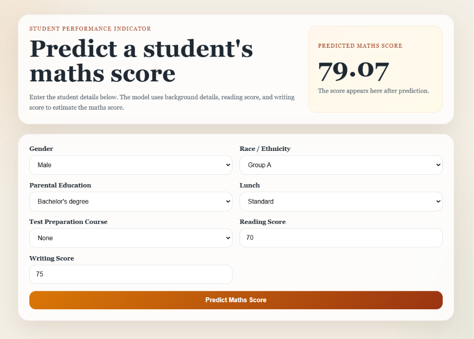

# Student Performance Indicator (End to End ML Project)

---

## Project Overview

This project predicts a student's **maths score** using demographic and academic input features such as:

- Gender
- Race / Ethnicity
- Parental level of education
- Lunch type
- Test preparation course
- Reading score
- Writing score

The project includes:

- **Exploratory Data Analysis (EDA)** in Jupyter Notebook
- **Machine Learning model training** with multiple regression algorithms
- **FastAPI backend** for prediction
- **React frontend** for a simple and clean prediction interface
- **Docker setup** for running the full app easily

The EDA notebook used for analysis is:

- `notebook/1 . EDA STUDENT PERFORMANCE .ipynb`

---

## Tools & Technologies Used

- **Python**
- **Pandas**
- **NumPy**
- **Matplotlib**
- **Seaborn**
- **Scikit-learn**
- **CatBoost**
- **XGBoost**
- **FastAPI**
- **React**
- **Vite**
- **Docker**
- **Docker Compose**

---

## Problem Statement

The goal of this project is to understand how student performance in maths is affected by other variables and then use those patterns to predict the **maths score** of a student.

---

## Dataset Description

The dataset contains **1000 student records** and **8 original columns**:

- `gender`
- `race/ethnicity`
- `parental level of education`
- `lunch`
- `test preparation course`
- `math score`
- `reading score`
- `writing score`

### Dataset Quality Checks

- Missing values: **0**
- Duplicate rows: **0**
- Numerical features: **3**
- Categorical features: **5**

---

## Exploratory Data Analysis

### Key Statistical Values

- Total records: **1000**
- Mean maths score: **66.09**
- Mean reading score: **69.17**
- Mean writing score: **68.05**
- Highest average subject score: **Reading**
- Lowest average subject score: **Maths**

### Score Distribution Insights

- Students scored lowest on average in **maths**
- Students scored best on average in **reading**
- Full scores:
  - Maths: **7**
  - Reading: **17**
  - Writing: **14**
- Scores below or equal to 20:
  - Maths: **4**
  - Reading: **1**
  - Writing: **3**

### Category-Level Insights

#### Gender

- Female students: **518**
- Male students: **482**
- Female average overall score: **69.57**
- Male average overall score: **65.84**
- Male average maths score: **68.73**
- Female average maths score: **63.63**

#### Race / Ethnicity

- Group C has the highest number of students: **319**
- Group A has the lowest number of students: **89**
- Average maths score by group:
  - Group A: **61.63**
  - Group B: **63.45**
  - Group C: **64.46**
  - Group D: **67.36**
  - Group E: **73.82**

#### Parental Education

Top average overall score by parental education:

- Master's degree: **73.60**
- Bachelor's degree: **71.92**
- Associate's degree: **69.57**

Lowest average overall score by parental education:

- High school: **63.10**

#### Lunch Type

- Standard lunch students: **645**
- Free/reduced lunch students: **355**
- Average score with standard lunch: **70.84**
- Average score with free/reduced lunch: **62.20**

#### Test Preparation Course

- Students with no course: **642**
- Students who completed the course: **358**
- Average score after completing the course: **72.67**
- Average score without completing the course: **65.04**

### Correlation Insights

The subject scores are strongly related to each other:

- Maths vs Reading: **0.82**
- Maths vs Writing: **0.80**
- Reading vs Writing: **0.95**

This shows that students who do well in reading and writing generally also perform better in maths.

---

## Analysis Visuals

### Average Score by Subject

<p align="center">
  
</p>

### Average Score by Gender

<p align="center">
  
</p>

### Average Score by Lunch Type

<p align="center">
  
</p>

### Average Score by Test Preparation Course

<p align="center">
  
</p>

---

## Prediction Model

The training pipeline tests multiple regression models:

- Linear Regression
- Decision Tree Regressor
- Random Forest Regressor
- Gradient Boosting Regressor
- XGBoost Regressor
- CatBoost Regressor
- AdaBoost Regressor

### Important Note About Metrics

This is a **regression project**, so the correct evaluation metrics are:

- **R2 Score**
- **MAE** (Mean Absolute Error)
- **RMSE** (Root Mean Squared Error)

`Accuracy` is mainly used for classification problems, not for predicting continuous values like maths scores.

### Model Comparison from the Training Notebook

The notebook `notebook/2. MODEL TRAINING.ipynb` compares multiple regression models and reports the following **R2 scores**:

| Model | R2 Score |
|------|---------:|
| Ridge | 0.880593 |
| Linear Regression | 0.880345 |
| CatBoosting Regressor | 0.851632 |
| AdaBoost Regressor | 0.850599 |
| Random Forest Regressor | 0.848724 |
| XGBRegressor | 0.827797 |
| Lasso | 0.825320 |
| K-Neighbors Regressor | 0.783813 |
| Decision Tree | 0.751724 |

### Best Model from Notebook Analysis

- **Best notebook model:** `Ridge`
- **Best notebook R2 Score:** `0.880593`

This means Ridge gave the strongest test performance among the models compared in the notebook.

### Currently Deployed Model

The current saved model used by the FastAPI prediction API is:

- **LinearRegression**

### Current Deployed Model Performance

Using the saved model and current test split:

- **R2 Score:** `0.8794`
- **Mean Absolute Error:** `4.2372`
- **RMSE:** `5.3238`

This means the model explains a strong portion of the variation in maths scores and usually predicts within a small error range.

---

## Web Application

This project now includes:

- **FastAPI backend** for prediction API
- **React frontend** for user input and prediction display

### React Home Page Placeholder

Replace this placeholder later with your actual React browser screenshot.

<p align="center">
  
</p>

### Prediction Result Placeholder

Replace this placeholder later with your actual prediction result screenshot.

<p align="center">
  
</p>

---

## FastAPI Endpoints

- `GET /` → API status message
- `POST /predictdata` → Predict maths score
- `GET /health` → Health check

### Example Prediction Input

```json
{
  "gender": "male",
  "raceEthnicity": "group C",
  "parentalEducation": "bachelor's degree",
  "lunch": "standard",
  "testPreparationCourse": "completed",
  "readingScore": 72,
  "writingScore": 75
}
```

### Example Prediction Output

```json
{
  "predicted_maths_score": 76.44
}
```

---

## Project Structure

```bash
Student Performce Indicator/
├── app.py
├── Dockerfile
├── docker-compose.yml
├── requirements.txt
├── setup.py
├── README.md
├── .dockerignore
├── artifacts/
│   ├── data.csv
│   ├── model.pkl
│   ├── proprocessor.pkl
│   ├── raw.csv
│   ├── test.csv
│   └── train.csv
├── assets/
│   ├── gender-average-analysis.png
│   ├── lunch-average-analysis.png
│   ├── prediction-result-placeholder.png
│   ├── react-page-placeholder.png
│   ├── subject-average-analysis.png
│   └── test-prep-analysis.png
├── frontend/
│   ├── Dockerfile
│   ├── package.json
│   ├── package-lock.json
│   ├── vite.config.js
│   └── src/
│       ├── App.jsx
│       ├── main.jsx
│       └── styles.css
├── notebook/
│   ├── 1 . EDA STUDENT PERFORMANCE .ipynb
│   ├── 2. MODEL TRAINING.ipynb
│   └── data/
│       └── stud.csv
└── src/
    ├── components/
    ├── pipeline/
    ├── exception.py
    ├── logger.py
    └── utils.py
```

---

## How to Run Locally

### Backend

```bash
pip install -r requirements.txt
uvicorn app:app --reload
```

Backend runs at:

```bash
http://127.0.0.1:8000
```

### Frontend

```bash
cd frontend
npm install
npm run dev
```

Frontend runs at:

```bash
http://localhost:5173
```

---

## Run with Docker

```bash
docker compose up --build
```

### Application URLs

- Frontend: `http://localhost:5173`
- Backend: `http://localhost:8000`

To stop containers:

```bash
docker compose down
```

---

## Business / Learning Insights

- Reading and writing scores are the strongest indicators for maths performance.
- Students with **standard lunch** perform noticeably better than those with **free/reduced lunch**.
- Students who **completed test preparation** show better overall scores.
- Female students lead in **overall average score**, while male students have a slightly higher **average maths score**.
- Students from **Group E** show the strongest average maths performance.
- Higher parental education levels are generally associated with stronger student performance.

---

## Future Improvements

- Add model comparison table directly in the README
- Save and show prediction history in the frontend
- Add input validation messages in the React UI
- Deploy the project on cloud using Docker
- Replace placeholder images with real browser screenshots

---

## Connect With Me

- **LinkedIn:** https://www.linkedin.com/in/akhilesh-yadav88/
- **Portfolio:** https://akhileshyadav8.github.io/
- **Email:** yadavakhil766@gmail.com

---

If you found this repository useful, consider giving it a star ⭐.
